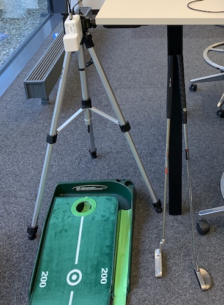
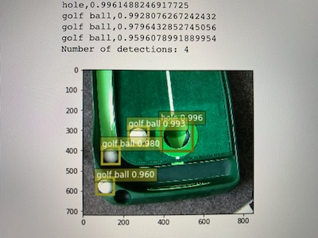

# deeplens-golfball

My personal toy project for learning on how to use AWS GroudTruth, AWS Sagemaker, AWS Greengrass, and AWS DeepLens to build a detector if a golfball is in the hole of a office putting green.

# Installation
Create a new project in the AWS DeepLens console, add the lambda code and one of the models in this repo to get started.

# Inference

